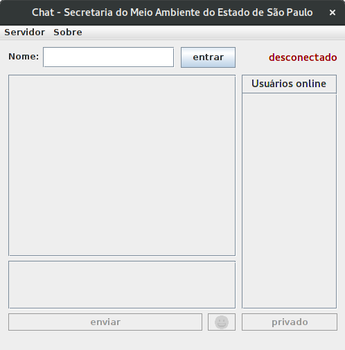
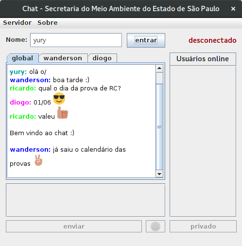
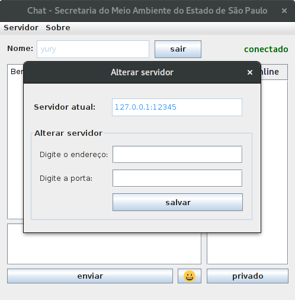

# SMASP-Chat
Chat com interface gráfica para comunicação em rede, entre duas ou mais pessoas, através do protocolo TCP/IP.

Este projeto foi desenvolvido durante a graduação em Ciência da Computação na UNIP.

O arquivo [APS - Chat.pdf](https://github.com/yuryrodrigues/SMASP-Chat/blob/master/APS%20-%20Chat.pdf) contém a dissertação sobre os fundamentos da comunicação de dados em rede e o projeto deste sistema. Incluindo a descrição da estrutura do sistema e as ferramentas utilizadas.

Imagens dos programas
-------------------

